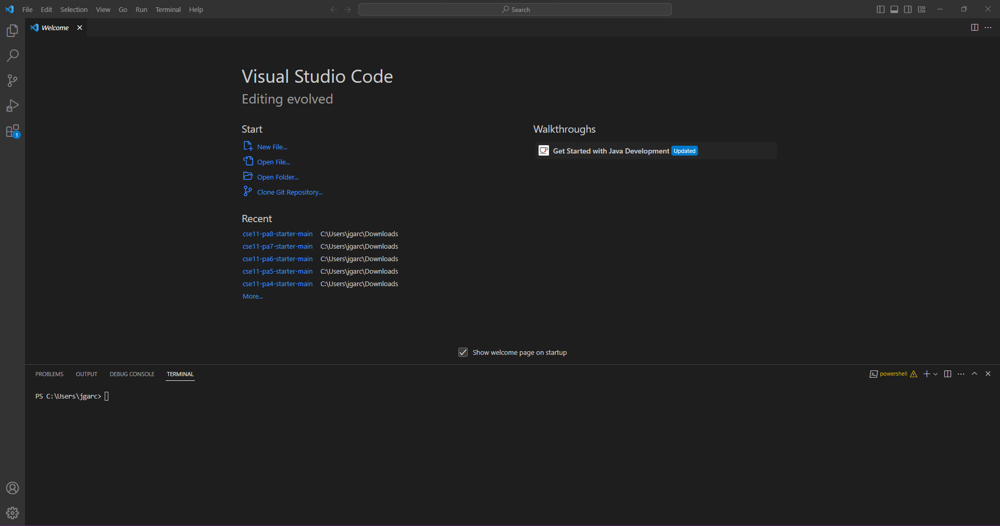

# Introduction 
One of the most important aspects in programming is to be able to work wherever you can no matter where you are. You are probably wondering how this can be done 
since this sounds like it can be really difficult however, this is really simple. The key to be able to do such thing is thorugh remote servers. They can be easily 
accessed and in this lab report I will be going over the steps on how you can connect to a remote server using an code editor called VS Code. By the end of the lab 
you should be able to remotley connect to a server using a ieng6 account thorugh VS Code.

# Installing VS Code
Before we try to connecting to a server we need to install VS Code as this will be the code editor we will be using to access the server. In my case I didn't have 
to installed VS Code as I had already installed since it was required for CSE 11 last quarter at UCSD. However, if you don't have VS Code install yet you can easily 
find it by going to this [link](https://code.visualstudio.com/). Click on the download which corresponds to your system (Windows/Mac) and follow the setps on the setup 
wizard. Once installed, open VS Code and you should see a screen similar to this:

*if you can see this screen then you have installed VS Code correctly*

# Gaining access to your ieng6 account
Now that you have VS Code the next step is to get access your ieng6 account as this will allow you to conect to the sever we are trying to reach. IN order to do this
you need to head to this [link](https://sdacs.ucsd.edu/~icc/index.php) in which you will look up your CSE 15L account. Once you reach this link you should see the following:

 

On this page it will prompt you to put in your username which will be your TritonLink username and your PID number. Afterwards you should reach a screen that look like this:

