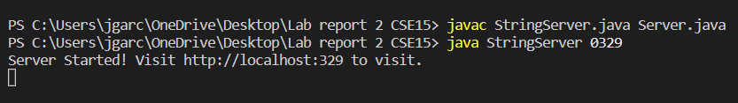
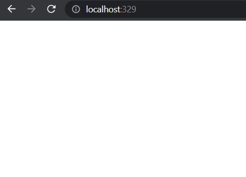
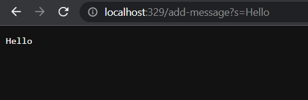
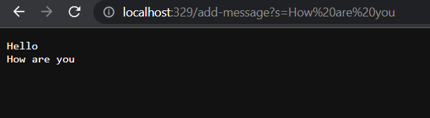

# LabReport 2
## Introduction
Knowing how to run and fix servers is a must for many programmers as it is one of the more important jobs in the world.
Especially when in todays world everything is know online and many biig companies want to expand their reach through the use of 
websites. So being able to fix and run servers can be very beneficial and many companies will be lokking for porgramers that have
this ability.

## Starting a Server
The goal this week was to start a web server that would be able to take in the command "/add-message?s=<String>" which allows a user
to input a message into where the "<String>" value would be and print a message on a page for example if someone where to type 
"/add-message?s=Hello" into the url, the page would then print Hello. The code that we used is this:

        import java.io.IOException;
        import java.net.URI;

        class Handler implements URLHandler {
        // The one bit of state on the server: a string that will be manipulated by
        // various requests.
        String message = "";

            public String handleRequest(URI url) {
                if (url.getPath().equals("/")) {
              return message;
            } else {
              if (url.getPath().equals("/add-message")) {
                 String query = url.getQuery();
                  if (query != null) {
                      String[] parameters = query.split("=");
                      if (parameters[0].equals("s")) {
                          if (message.isEmpty()) {
                              message = parameters[1];
                          } else {
                              message += "\n" + parameters[1];
                          }
                          return message;
                      }
                  }
              }
              return "404 Not Found!";
          }
      }
    }
        class StringServer {
            public static void main(String[] args) throws IOException {
                if (args.length == 0) {
                    System.out.println("Missing port number! Try any number between 1024 to 49151");
                    return;
                }

                int port = Integer.parseInt(args[0]);

                Server.start(port, new Handler());
            }
        }

This code allowed for the user on the website to type messages into the URl which can be seen in these screenshots below:
  
 
 
The image above is showing how to run the sever in which we have to compile the StringServer.java and Server.java files and afterwards we can start the String Server file but we also have to include a port in order for the server to function properly. 
  
 
 
This image is showing the web server running however, there is nothing on the page as no message has been added. 
 
  
If you look at the url you can see that after the domain you can see the message "/add-message?s=Hello" which allowed the page to print a hello message.

  

If you do it again as demonstrated on this image a new message will appear on a new line under the old message.
The way this is working is due to the fact that everytime the "/add" method is found this calls the handleRequest method from the code. 
When a request is made to /add-message?s=<string>, the handleRequest method is called with a URI object representing the requested URL. 
The URI object has a path of "/add-message" and a query of "s=<string>". In the handleRequest method, the message field of the Handler class gets cahnged
when a new message is added and since the message field is initially empty, it gets appended with the new message string.
