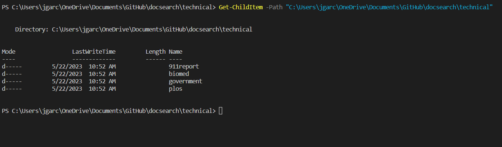
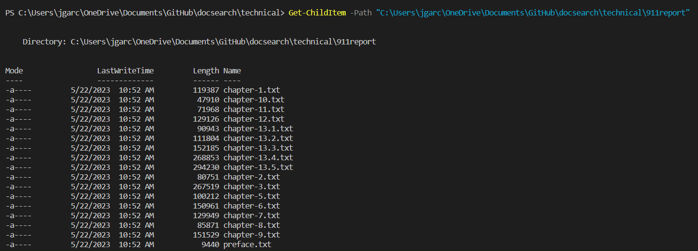
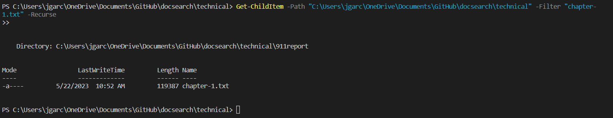
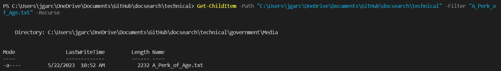
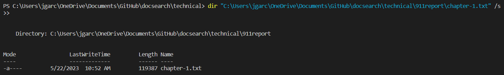
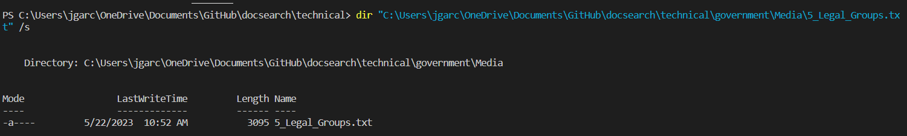
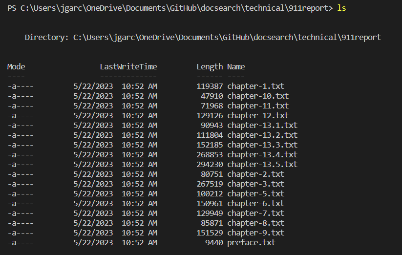

# Alternative Commands for -find (on Windows)
When coding it is very important to know a wide variety of commands since they can prove to be helpful and maybe faster when coding. You may find that 
some commands are very similar to each other and may have similar functions. Today we are going to be looking at different alternatives for the -find 
on a windows operating system. 

## getChildItem
This command is made for windows powershell. It is used for retrieving a list of files and directories. When combined with -path it can find directories and files that are given. 
    
    Get-ChildItem -Path "C:\path\to\directory" 

Here are some examples of the comammnd being used:

In this code we use the path to print all the directories under the "\technical" directory however, since we didn't specify another firectory it will only print
the directories and not the files.

For this code it is similar to the previous command however, this time we change the path to go into the "\911report" directory which will printed all of the 
txt files in that directory.

## -filter
This command is used to specify the pattern or filename you want to search for. This filters the results to include only files with that exact filename.
When combined with GetChildItem it can be used to find specific files with the exact name given. 

    Get-ChildItem -Path "C:\path\to\directory" -Filter "*.txt" -Recurse

Here are some examples of the command:

In this command we use -filter at then en of getChildItem to find the specific file, in this case "chapter-1.txt", which allows the system to seach for that file.

Same thing with this image -filter is used towards the end and since filter looks for the specific file in \technical there is no need to change the path as it
will still search for the given file.

## -dir
This command is used to list files or directories in specified areas, when combined with a path it can search for the file given in that directory. The /s at the end is a recursive search that searches for the file in other subdirectories apart from the specified one.

    dir "C:\path\to\directory\*.txt" \s

For this code it is very similar to the -path format in where you use the path in order to get the desired code, however for this one you can just simply write out the path that you want by going into the directories desired and ending it with the the file you want.

The same thing is ocrruing in this code except to reach the file in the code you need to add the corresponding directories to reach the file itself. 

## -ls
Although not as specific as the other 3 alternatives, this command prints the files in that directory and it can be paired with other commands in order to be more thorough and precise.

    ls /path/to/directory

In these code the ls command prints out the files based on the given directory, so although it isn't able to print files on thhier own it is very useful to view the files in a certain directory as demonstrated in the examples provided.

## How I found these commands

I originally looked up alternatives for the the command -find and found myself on this page:
[link](https://unix.stackexchange.com/questions/13496/alternative-to-find) 
I had originally chosen the commands -name, -locate, -ack, -fd but as I was trying to run them on my terminal they were not working and kept receiving this message:

    locate : The term 'locate' is not recognized as the name of a cmdlet, function, script file, or operable program. Check the spelling of the name, or if a path     was 
    included, verify that the path is correct and try again.
    At line:1 char:1
    + locate 911report/chapter-1.txt
    + ~~~~~~
        + CategoryInfo          : ObjectNotFound: (locate:String) [], CommandNotFoundException
        + FullyQualifiedErrorId : CommandNotFoundException

I wasn't sure why it wasn't working but then I asked chatGPT since I was stuck and then it brought to my attention that the commands I was trying to use were made for a system that uses Linux. Since I was on a windows computer I had to sue different commands which is what led me to the commands I gave in the examples above. 
