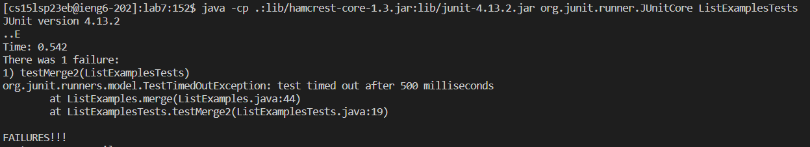
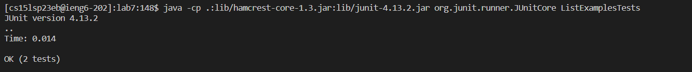

# Lab Report 4
In this lab report we were given a a code which had an error in it and we were told to change and fix the code using script. Using script felt very nice 
and efficient and I was suprised to see the diffrerent types of commands that you can use to edit the code. Many allowed to fix the code a lot faster which 
can be very helpful in a professional setting. The code given is porvided below:
    
    class ListExamples {   
      // Returns a new list that has all the elements of the input list for which
      // the StringChecker returns true, and not the elements that return false, in
      // the same order they appeared in the input list;
      static List<String> filter(List<String> list, StringChecker sc) {
        List<String> result = new ArrayList<>();
        for(String s: list) {
          if(sc.checkString(s)) {
            result.add(0, s);
          }
        }
        return result;
      }
    
    
      // Takes two sorted list of strings (so "a" appears before "b" and so on),
      // and return a new list that has all the strings in both list in sorted order.
      static List<String> merge(List<String> list1, List<String> list2) {
        List<String> result = new ArrayList<>();
        int index1 = 0, index2 = 0;
        while(index1 < list1.size() && index2 < list2.size()) {
          if(list1.get(index1).compareTo(list2.get(index2)) < 0) {
            result.add(list1.get(index1));
            index1 += 1;
          }
          else {
            result.add(list2.get(index2));
            index2 += 1;
          }
        }
        while(index1 < list1.size()) {
          result.add(list1.get(index1));
          index1 += 1;
        }
        while(index2 < list2.size()) {
          result.add(list2.get(index2));
          // change index1 below to index2 to fix test
          index1 += 1;
        }
        return result;
      }
    
    
    }
Here is the message given if we try to run the code:

## What I did to fix the code

In order to fix the code we need to change index1 to index2 in and in order to do that I did the following steps below:
    
    J (down) <43>

When entering the script we started I started at the top so i had to press the j key 43 times to reach the appropriate line that needed to be changed.

    L (right) <11>

Once at the line I had to move the cursor to the index that needed to be changed, which in this case was the 1 in “index1” which had to be changed to a 2.

    R <2>

To do the appropriate changes I took advantage of the replace command which replaces the element at the cursor with the new element that you choose. 
The reason I did this was because it was a lot faster and since it was just 1 element that needed to be changed the replace command seemed to work the best in 
this situation.

    :wq

Finally to save these changes we used the save and exit command to save the file.

After doing these changes, if we run the code again we get the following results:

As you can see after making the changes we were able to fix the code and it was able to pass both the test. There most likkley other alternative commands that 
could also fix the code however the way I did took around 10-13 seconds (not official). One of these altenative ways could be that instead of pressing the j key
43 times I could've done ":43" which brings the cursor down to the 43rd line which saves a lot more time. Another go tip I found out on accident is that when 
typing commmands onto the terminal you can access previous commands from your history using the up and down arrow keys which made it a lot faster to run the 
commands since I didn't have to write it after everytime I encountered an issue. In the end I was able to effienciently finish the code and fix it so it can run 
appropiratley and it was done it a way that was quick and simple but there are definietly other ways to fix the code.
