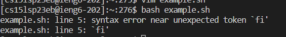

# Lab Report 5: Debugging 
In this report we will be mimicing a TA responding to a student who is having a debugging problem with thier code. In order for the reponse to be useful we need to make sure that we are clear
and thorough so the student will be able to fix thier code. 

## The Issue
Below will be an example of a student's debugging problem:
 
What environment are you using (computer, operating system, web browser, terminal/editor, and so on)?

I am using a windows laptop and editing the code on VS Code.

Detail the symptom you're seeing. Be specific; include both what you're seeing and what you expected to see instead. Screenshots are great, copy-pasted terminal output is also great. 
Avoid saying “it doesn't work”:

I tried to run this code:

    VAR = 7
    
    if [[1 -eq $VAR ]]
      echo "it was 1"
    fi

but gave me the following error:

Any suggestions on how I could fix this code?

## How to fix

Hello! It seems that you are trying to run a code ran on a bash script. One very important thing to know about wirting code on script is that you have to make sure that you get the format of the 
methods. for example in this code it seems a very important part in an "if" statement. Normally just like it java when writing and if statement it needs to be followed by an else statement.
In script you need to do the same thing except this time instead of "else" you use "then". Therefore an examples would be like the following:

    if a = 1
    then 
      echo "a is 1!"
    fi

this allows the if stement to run properly without any issues. Futhermore you should double check for smaller issues (such as spacing) as script can be very specific on its format and that could
cause issues in your code. Which might cause furthers issues in your code. Let me know if you run into anymore issues!

## Reflection 
Through out the rest of the quarter I leanred some pretty cool things stuff and I think one of my favorite things to learn was the vim editor because it felt like I was able to edit this code 
without having to download the code. This allowed me to edit the code from anywhere and I thought that was pretty cool since it can come in very handy when you have to edit a code you dont have access too 
nearby. This might've been due to lab where we fist learned about vim and the tutorial, although at first it was taking a while for me to learn the differents commands once I got the hang of it traversing
code seemed way easier and less time consuming. Due to this this made me enjoy coding a lot more in the end since it felt a lot faster and useful for the future. 
